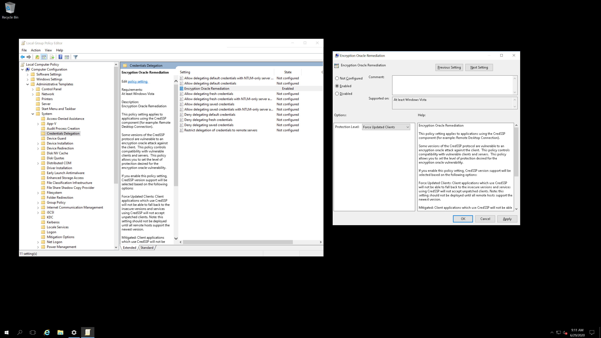

IPBan Service
-----
[](https://dev.azure.com/DigitalRuby/DigitalRuby/_build/latest?definitionId=4&branchName=master)

[](https://www.paypal.com/cgi-bin/webscr?cmd=_s-xclick&hosted_button_id=7EJ3K33SRLU9E)

<a href="https://ipban.com/newsletter">Sign up for the IPBan Mailing List</a>

Please visit <a href='https://ipban.com'>https://ipban.com</a> to learn about IPBan Pro with advanced functions including shared ban lists, country blocking, central config management for all your machines and much more.

You can also visit the ipban discord at https://discord.gg/Mf59n8PfTH to chat with me or other IPBan users.

**Requirements**
- IPBan requires .NET 5 SDK to build and debug code. For an IDE, I suggest Visual Studio Community 2019 for Windows, or VS code for Linux. All are free. You can build a self contained executable to eliminate the need for dotnet core on the server machine, or just download the precompiled binaries.
- Running and/or debugging code requires that you run your IDE or terminal as administrator or root.
- Officially supported platforms: Windows 8.1 or newer (x86, x64), Windows Server 2012 or newer (x86, x64), Linux (Ubuntu, Debian, CentOS, RedHat x64). Windows Server 2008 will work with some tweaks, but it is basically at end of life, so no longer officially supported. Please note that for CentOS and RedHat Linux, you will need to manually install iptables and ipset using yum package manager.
- Mac OS X not supported at this time.

**Features**
- Auto ban ip addresses on Windows and Linux by detecting failed logins from event viewer and/or log files. On Linux, SSH is watched by default. On Windows, RDP, OpenSSH, VNC, MySQL, SQL Server and Exchange are watched. More applications can easily be added via config file.
- Highly configurable, many options to determine failed login count threshold, time to ban, etc.
- Make sure to check out the ipban.config file (formerly named DigitalRuby.IPBan.dll.config, see IPBanCore project) for configuration options, each option is documented with comments.
- Banning happens basically instantly for event viewer. For log files, you can set how often it polls for changes.
- Very fast - I've optimized and tuned this code since 2012. The bottleneck is pretty much always the firewall implementation, not this code.
- Unban ip addresses easily by placing an unban.txt file into the service folder with each ip address on a line to unban.
- Works with ipv4 and ipv6 on all platforms.
- Please visit the wiki at https://github.com/DigitalRuby/IPBan/wiki for lots more documentation.

**Download**

- Official download link is: https://github.com/DigitalRuby/IPBan/releases

Install
------

Please note that for IPBan Pro, you can find install instructions at https://ipban.com/Docs/Install. These install instructions here on github are for the free IPBan version.

**Windows**
- IPBan is supported on Windows Server 2012 and Windows 8, or newer.
- Easy one click install, open admin powershell and run:
```
[Net.ServicePointManager]::SecurityProtocol = [Net.SecurityProtocolType]::Tls12; iex ((New-Object System.Net.WebClient).DownloadString('https://raw.githubusercontent.com/DigitalRuby/IPBan/master/IPBanCore/Windows/Scripts/install_latest.ps1'))
```
Note: Powershell 5.1 or greater is required.

***Additional Windows Notes***
- It is highly recommended to disable NTLM logins and only allow NTLM2 logins. Use secpol -> local policies -> security options -> network security restrict ntlm incoming ntlm traffic -> deny all accounts. You must disable NLA if you do this or you will be locked out of your machine (Control Panel -> System and Security -> System -> Advanced Settings -> Remote Tab (uncheck NLA)).
- Please ensure your server and clients are patched before making the above change: https://support.microsoft.com/en-us/help/4093492/credssp-updates-for-cve-2018-0886-march-13-2018. You need to manually edit group policy as specified in the link.

- Instead of the above, you can try: local policy "Network Security -> LAN Manager authentication level" to "NTLMv2 response only/refuse LM and NTLM".
- NLA is not supported with IPBan on Windows Server 2012 or older. You must use Windows Server 2016 or newer if you want NLA. Failed logins do not log properly with NLA on the older Windows editions, regardless of any settings, registry or group policy changes.
- On Windows Small Business Server 2011 (and probably earlier) and Windows Server running Exchange, with installed PowerShell v.2 that does not know Unblock-File command, and newer version can’t be installed (as some scripts for managing OWA stop working correctly). Easier way is to manually unblock downloaded ZIP file and then unzip content.
- On Windows Server running Exchange, it is impossible to disable NTLM (deny all clients in Security restrict ntlm incoming ntlm traffic) as then Outlook on client computers permanently asks users for entering username and password. To workaround this, set LAN Manager authenticating level in Security Options of Local Policies to "Send NTLMv2 response only. Refuse LM & NTLM". There is one small issue – when somebody tries to login with an undefined username, the log does not contain an IP address. Not sure why Microsoft can't log an ip address properly.
- If using Exchange, disabling app pool 'MSExchangeServicesAppPool' can eliminate quite a lot of problems in the event viewer with ip addresses not being logged.

**Linux**

- IPBan is supported on most Linux operating systems.
- Easy one click install:
```
sudo -i; bash <(wget -qO- https://raw.githubusercontent.com/DigitalRuby/IPBan/master/IPBanCore/Linux/Scripts/Install.sh)
```

Other Information
------

**Analytics**

To disable anonymously sending banned ip addresses to the global ipban database, set UseDefaultBannedIPAddressHandler to false in the config file.

**About Me**

I'm Jeff Johnson and I created IPBan to eliminate bot nets, hackers and brute force login attempts. IPBan improves the security and performance of your machines and gets the bad actors in the block rule of the firewall where they belong.

Please visit <a href='https://ipban.com'>https://ipban.com</a> for additional updates, news, additional software and more.

I do consulting and contracting if you need extra customizations for this software.

Donations are accepted, any amount is appreciated, I work on this project for free to benefit the world.

[](https://www.paypal.com/cgi-bin/webscr?cmd=_s-xclick&hosted_button_id=7EJ3K33SRLU9E)

<a href="https://email.digitalruby.com/SubscribeInitial/IPBan">Sign up for the IPBan Mailing List</a>

Jeff Johnson, CEO/CTO  
Digital Ruby, LLC  
https://www.digitalruby.com  
support@digitalruby.com


